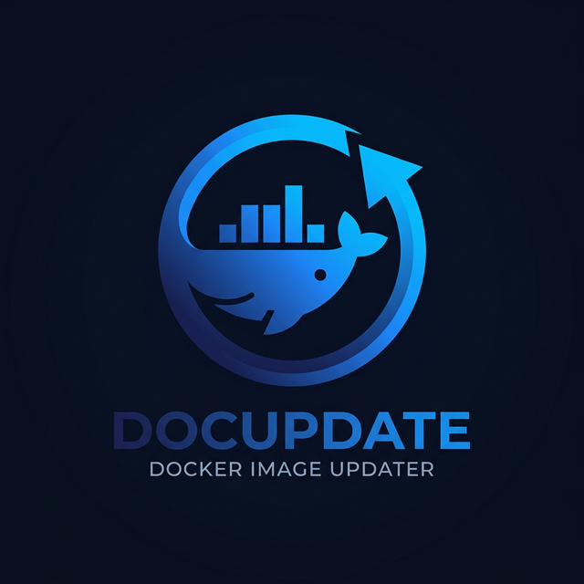
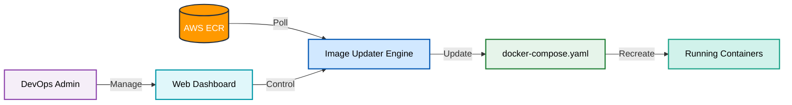
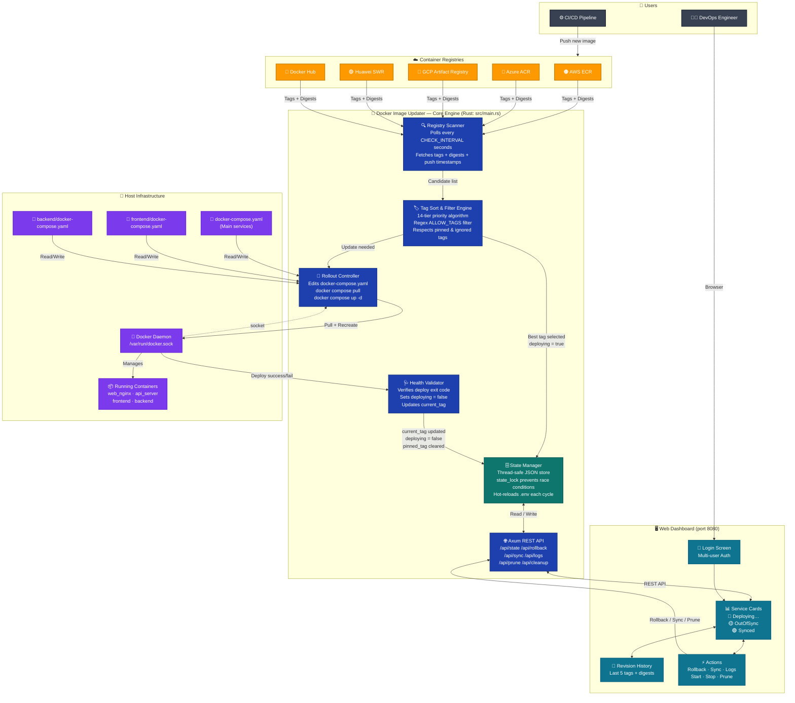
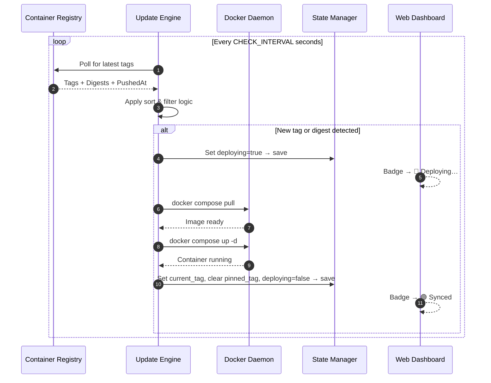
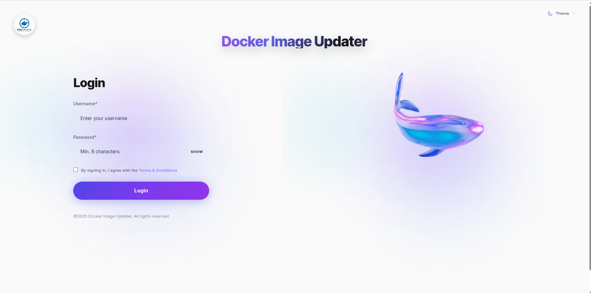
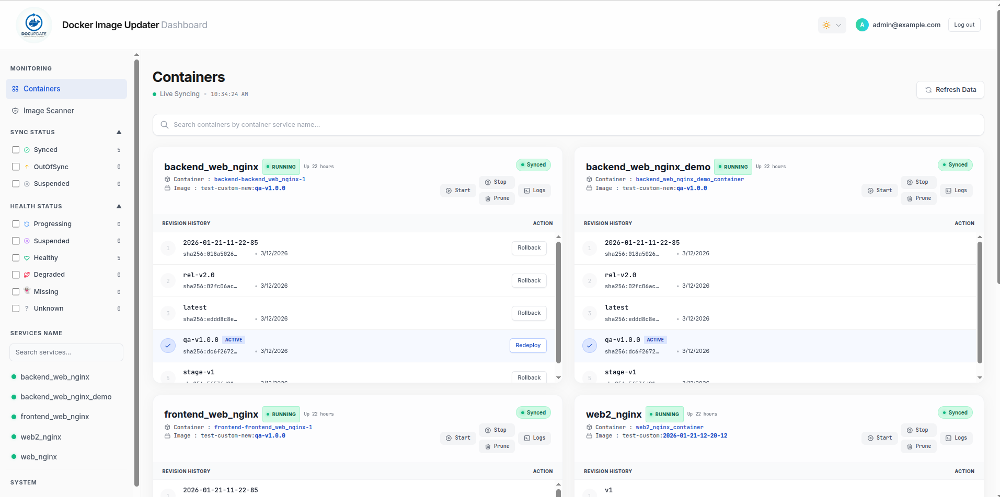
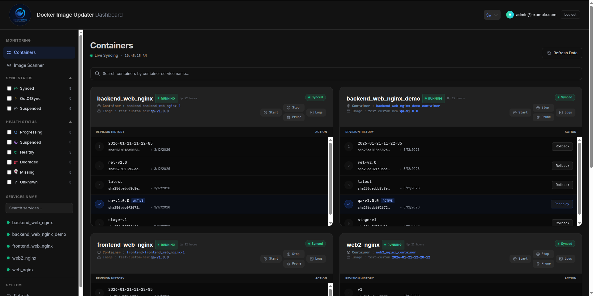

<div align="center">



# Docker Image Updater

**Automatic container image updates for Docker Compose environments — with a premium real-time dashboard.**

[](https://hub.docker.com/r/piku143/docker-image-updater)
[](https://github.com/pradeep-antier973/DI-Updater)
[](https://opensource.org/licenses/MIT)
[](https://www.rust-lang.org/)
[](https://docs.docker.com/compose/)

[**Quick Start**](#-installation--setup) · [**Configuration**](#-configuration-guide) · [**Dashboard**](#-ui-dashboard) · [**Roadmap**](#-roadmap) · [**Contributing**](#-contributing-guide)

</div>

---

## 📖 Project Overview

Modern DevOps teams invest heavily in CI/CD pipelines that build and push Docker images to container registries. However, **getting those new images running in production** — especially in Docker Compose environments — often still requires manual intervention: SSH into the server, pull the new image, restart the service, and verify it's healthy.

**Docker Image Updater** eliminates this gap entirely. It is a **native Rust binary** that brings Kubernetes-level GitOps workflows to any standard Docker Compose stack with zero overhead.

---

## 🦀 Why Rust?

Docker Image Updater was rewritten from Python to Rust to provide enterprise-grade reliability and performance:
- **Zero Overhead**: Minimal RAM footprint (~15MB) allows it to run on the smallest VPS or edge nodes.
- **High Concurrency**: Built on **Tokio** and **Axum**, it handles multiple registry polling cycles and dashboard requests with millisecond latency.
- **Type Safety**: Rust's "Fearless Concurrency" ensures that complex deployment states are never corrupted by race conditions.
- **Binary Portability**: A single, self-contained binary deployment means no Python/JS environment management on your production hosts.

### ⚡ Quick Logic Flow



---

## ✨ Key Features

| Feature | Description |
| :--- | :--- |
| 🔍 **Automatic Image Detection** | Polls registries every N seconds and detects new tags or digest changes |
| 🚀 **Rolling Container Updates** | Pulls image and recreates containers with zero manual SSH required |
| 🩺 **Health Verification** | Tracks deploying state and only marks service `Synced` after container is confirmed running |
| 🦀 **Rust Core Engine** | High-performance, memory-safe backend built with **Axum** and **Tokio** |
| 🟡 **Deploying Badge** | UI shows a real-time pulsing `Deploying…` badge during rollout; no false `OutOfSync` flash |
| 🌐 **Multi-Registry Support** | AWS ECR, Docker Hub, Azure ACR, Google Artifact Registry, Huawei SWR |
| 🕶️ **Neo-Industrial UI** | Premium, dark-mode landing page and dashboard with glassmorphism aesthetics |
| 🛡️ **Vulnerability Scanning** | Integrated **Trivy** scanning — identifies CVEs with detailed reports (CSV/HTML/Text) |
| 🔄 **Atomic Rollbacks** | Force-recreate logic ensures the existing process is completely overwritten during rollbacks |
| 🗃️ **Revision History** | See the last 5 image tags per service and one-click rollback to any previous version |
| 🏷️ **Intelligent Tag Sorting** | 14-tier priority algorithm handles Semver, timestamps, build IDs, and more |

---

## 🌐 Supported Registries

| Registry | Provider | Auth Method |
| :--- | :--- | :--- |
| **AWS ECR** | Amazon Web Services | IAM Role / Access Key + Secret |
| **Azure Container Registry (ACR)** | Microsoft Azure | Admin credentials / Service Principal |
| **Google Artifact Registry / GCR** | Google Cloud | Access Token / Service Account JSON |
| **Docker Hub** | Docker Inc. | Username + Password / Token (public or private) |
| **Harbor** | CNCF / Self-hosted | Username + Password (robot accounts supported) |
| **Huawei SWR** | Huawei Cloud | AK/SK credentials / Pre-generated login key |
| **DigitalOcean (DOCR)** | DigitalOcean | Personal Access Token (PAT) |

> **Note:** All seven registries are supported by `generate_env.sh` auto-configuration. Select your registry at runtime and the script generates a ready-to-use `.updater.env` in seconds.

---

## ☁️ Cloud Support & Roadmap

| Cloud Provider | Registry | Status |
| :--- | :--- | :--- |
| **Amazon Web Services** | AWS ECR | ✅ Fully Functional |
| **Microsoft Azure** | Azure ACR | ✅ Fully Functional |
| **Google Cloud** | GCR / Artifact Registry | ✅ Fully Functional |
| **Docker Inc.** | Docker Hub (Public & Private) | ✅ Fully Functional |
| **CNCF / Self-hosted** | Harbor Registry | ✅ Fully Functional |
| **Huawei Cloud** | Huawei SWR | ✅ Fully Functional |
| **DigitalOcean** | DO Container Registry (DOCR) | ✅ Fully Functional |

---

## 🏗️ Architecture Overview

### System Architecture Diagram



### Components

| Component | Role |
| :--- | :--- |
| **Registry Scanner** | Authenticates with the configured registry and polls for new image tags/digests on every cycle |
| **Image Update Engine** | Applies the 14-tier tag-sorting algorithm, respects pinned tags and ignored tags, and decides whether an update is needed |
| **Container Rollout Controller** | Updates the `docker-compose.yaml` file, runs `docker compose pull` then `docker compose up -d` |
| **Health Check Validator** | Waits for deployment to complete; only writes `current_tag` and `deploying=false` to state after success |
| **Auto Sync State Manager** | Thread-safe JSON state store with a `state_lock`; drives UI badge transitions (`Deploying→Synced`) |
| **UI Dashboard** | Axum-powered SPA backend with real-time polling, revision history, rollback controls, and live container logs |

### Deployment Lifecycle



---

## 📂 Project Folder Structure

```
DI-Updater/
│
├── backend/
│   └── docker-compose.yaml        # Target compose file for backend service group
│
├── demo-backend/
│   └── docker-compose.yaml        # Example compose file for demo/testing
│
├── frontend/
│   └── docker-compose.yaml        # Target compose file for frontend service group
│
├── .updater.env                   # Active runtime configuration (gitignored)
├── .gitignore                     # Prevents secrets and state files from being committed
│
├── docker-compose.yaml            # Example compose file for the main web services
├── updater-compose.yml            # Deployment manifest for the updater itself
│
├── generate_env.sh                # 7-registry interactive auto-config script
├── ecr-role.sh                    # Helper: Configure AWS IAM role for ECR
├── gcp-role.sh                    # Helper: Configure Google Cloud IAM for GCR/AR
├── swr-role.sh                    # Helper: Configure Huawei SWR permissions
├── docr-role.sh                   # Helper: Configure DigitalOcean Registry access
├── harbor-role.sh                 # Helper: Configure Harbor Registry access
└── README.md                      # This file
```

---

## ⚙️ How It Works

### Step-by-Step Workflow

```
Step 1 ── Scan Registry
          Every CHECK_INTERVAL seconds, the engine authenticates
          with the configured registry (ECR, ACR, GCR, etc.) and
          fetches the latest tagged image list.

Step 2 ── Detect New Tag
          The 14-tier sorting algorithm ranks candidates by:
          push timestamp → semver → timestamp tag → build ID → generic.
          It filters out pinned tags and ignored tags.

Step 3 ── Trigger Update
          If the desired tag differs from current_tag in the
          compose file, the engine marks the service as deploying=true
          and saves the state (UI badge immediately shows "Deploying…").

Step 4 ── Pull New Image
          docker compose -f <path> pull
          Layers are downloaded in parallel per service.

Step 5 ── Replace Container
           The old container is recreated with the new image. ROLLBACKS use
           `--force-recreate` to ensure any stale process state is overwritten.

Step 6 ── Vulnerability Scan (Optional)
           If enabled, the engine triggers a Trivy scan on the newly 
           deployed image, generating a summary for the UI and an
           in-depth report available for download.

Step 7 ── Confirm Running
           The engine verifies the deployment command exited cleanly,
           confirming Docker restarted the container successfully.

Step 8 ── Auto Sync
          current_tag is updated to the newly deployed tag.
          If this was a manual rollback (pinned_tag was set):
            - pinned_tag is cleared automatically
            - newer tags are added to ignored_tags so the service
              stays pinned at the rolled-back version
          deploying=false is saved → UI badge transitions to "Synced" ✅
```

---

## 🚀 Installation & Setup

### Prerequisites

- Docker `>= 20.10` and Docker Compose `>= 2.x`
- Access to at least one container registry
- For AWS ECR: an IAM user/role with ECR read permissions

## ⚡ 5-Minute Setup (Auto-Configuration)

Docker Image Updater is designed to be configured in **under 5 minutes** for any project. Instead of manual editing, use our Bash-based automation to detect your services and generate the configuration.

### 🛠️ Using `generate_env.sh`

This script automatically scans all running Docker containers on your instance, detects which ones belong to your selected registry, and generates a ready-to-use `.updater.env` in seconds.

**What it does:**
1. Presents an interactive menu to select your registry provider.
2. For Docker Hub, prompts a second sub-menu to choose **Public**, **Private**, or **Both** image types.
3. Scans only the containers that belong to the selected registry — other registries are completely ignored.
4. Auto-detects registry hostnames, account IDs, regions, project IDs, and namespace values from running container image URIs.
5. Preserves existing credentials across re-runs — never overwrites passwords or tokens you've already set.
6. Writes a clean, commented `.updater.env` with `ALLOW_TAGS`, `COMPOSE_FILE_PATH_*`, and all registry-specific variables.

**Usage:**
```bash
# 1. Clone the repository
git clone https://github.com/pradeep-antier973/DI-Updater.git
cd DI-Updater

# 2. Run the auto-generator
bash generate_env.sh

# 3. Start the updater
docker compose -f updater-compose.yml up -d
```

**Interactive registry menu:**
```
=========================================
  Select Cloud Provider & Container Registry
=========================================
  1) AWS         - Amazon ECR
  2) Azure        - Azure Container Registry (ACR)
  3) GCP          - Google Container Registry (GCR / Artifact Registry)
  4) Docker Hub
  5) Harbor       - Harbor Registry
  6) Huawei Cloud - SWR (Software Repository for Containers)
  7) DigitalOcean - DO Container Registry (DOCR)
=========================================
  Enter your choice [1-7]:
```

**Docker Hub image-type sub-menu (shown only when option 4 is selected):**
```
=========================================
  Docker Hub — Image Visibility
=========================================
  1) Public   - No credentials needed
  2) Private  - Requires username & password/token
  3) Both     - Public + Private (credentials stored)
=========================================
  Enter your choice [1-3]:
```

**Example generated output (Harbor selected):**
```env
ADMIN_EMAIL=admin@example.com
ADMIN_PASSWORD=password123
CHECK_INTERVAL=30
ALLOW_TAGS="regexp:^(?=.{1,25}$)(v[0-9]+(\.[0-9]+){0,2}(-[a-z0-9]+)?|B[0-9]+|[0-9]{4}(-[0-9]{2}){5}|[a-z0-9]{7,15}|test-[a-z0-9-]+|prod|dev|qa|uat|stage|staging|latest|develop|(rel|release|stage|prod|dev|qa|uat)-v?[0-9]+(\.[0-9]+){0,2}(-[a-z0-9]+)?)$"

COMPOSE_FILE_PATH_BACKEND=/home/user/backend/docker-compose.yaml

# Harbor Configuration — Image Type: harbor
HARBOR_URL=harbor.mycompany.com
# HARBOR_USERNAME=robot$myrobot
# HARBOR_PASSWORD=mysecret
HARBOR_REPOSITORY_MAP_BACKEND=api-service=myproject/api,frontend=myproject/web
```

---

### 🔐 AWS IAM Role Setup (`ecr-role.sh`)

If you are deploying on AWS, the updater needs permission to read ECR metadata. Instead of manually creating policies in the AWS Console, you can use our helper script.

**What it does:**
1.  **Detects Account ID**: Automatically gets your AWS Account ID using `sts get-caller-identity`.
2.  **Creates IAM Role**: Provision a role named `ImageUpdaterECRRole` with a secure trust policy.
3.  **Attaches ECR Policy**: Creates a least-privilege policy allowing the updater to `DescribeImages` and `BatchGetImage` across your repositories.
4.  **Outputs ARN**: Provides the exact `AWS_ROLE_ARN` string to paste into your `updater.env`.

**Usage:**
```bash
# Run the script (requires AWS CLI configured locally)
bash ecr-role.sh
```

**Result:**
You'll get an output like: `AWS_ROLE_ARN=arn:aws:iam::<AWS_Account_ID>:role/ImageUpdaterECRRole`.

---

## 🚀 Installation & Setup

```bash
# Pull the latest image
docker pull piku143/docker-image-updater:latest

# Copy and edit the environment template
cp updater.env.example updater.env
nano updater.env

# Start the updater
docker compose -f updater-compose.yml up -d
```

### Option B — Build from Source

```bash
# Clone the repository
git clone https://github.com/pradeep-antier973/DI-Updater.git
cd DI-Updater

# Configure environment
cp updater.env.example updater.env
nano updater.env

# Build the image
docker build -t piku143/docker-image-updater:latest .

# Start the updater
docker compose -f updater-compose.yml up -d
```

### Option C — Local Development (Rust)

```bash
git clone https://github.com/pradeep-antier973/DI-Updater.git
cd DI-Updater

cargo build

cp updater.env.example updater.env
nano updater.env

cargo run
```

Access the dashboard at **http://localhost:8080**

---

## ⚙️ Configuration Guide

The entire system is configured via `updater.env`. This file supports **hot-reload** — changes take effect on the next check cycle without restarting the container.

### 🔑 Authentication (Multi-User)

```env
# Method 1: Single AUTH_USERS string (email:password pairs, comma-separated)
AUTH_USERS=admin@example.com:securepass,devops@example.com:anotherpass

# Method 2: Individual PREFIX_EMAIL / PREFIX_PASSWORD pairs (supports multiple users)
ADMIN_EMAIL=admin@example.com
ADMIN_PASSWORD=securepassword123

USER1_EMAIL=devops@company.com
USER1_PASSWORD=devops-secret456
```

> **Security note:** Passwords are securely handled in-memory using **SHA256 hashing**. They are **never** stored on disk in plain text.

### 🔧 Registry Settings

#### AWS ECR

```env
AWS_ACCOUNT_ID=<AWS_Account_ID>
AWS_REGION=us-east-2
ECR_REGISTRY=$AWS_ACCOUNT_ID.dkr.ecr.$AWS_REGION.amazonaws.com

# Option A: IAM Role (recommended for EC2/ECS deployments)
AWS_ROLE_ARN=arn:aws:iam::$AWS_ACCOUNT_ID:role/ImageUpdaterECRRole

# Option B: Access Key (for dev or cross-account)
# AWS_ACCESS_KEY_ID=<access_key>
# AWS_SECRET_ACCESS_KEY=<secret_key>

ECR_REPOSITORY_MAP_BACKEND=api_svc=my-ecr-repo,frontend=my-frontend-repo
```

#### Azure Container Registry (ACR)

```env
# Auth option A — Admin credentials (enable admin user in ACR → Access keys):
AZURE_REGISTRY=myregistry          # Registry name only; .azurecr.io is appended automatically
AZURE_USERNAME=myregistry          # Admin username shown in Access keys blade
AZURE_PASSWORD=<password>

# Auth option B — Service Principal (RBAC / AcrPull role):
# AZURE_REGISTRY=myregistry
# AZURE_TENANT_ID=<tenant-uuid>    # Setting this enables SP mode
# AZURE_CLIENT_ID=<sp-app-id>
# AZURE_CLIENT_SECRET=<sp-secret>

AZURE_REPOSITORY_MAP_BACKEND=api_svc=my-api:v*
```

#### Google Container Registry / Artifact Registry (GCR)

```env
GCP_REGISTRY_URL=gcr.io            # or us-docker.pkg.dev / eu-docker.pkg.dev
GCP_PROJECT=my-gcp-project

# Auth option A — pre-generated access token (short-lived, rotate via cron):
# GCP_ACCESS_TOKEN=ya29.xxxxxxxxxxxx

# Auth option B — Service Account JSON key:
# GCP_SERVICE_ACCOUNT_JSON={"type":"service_account", ...}

GCP_REPOSITORY_MAP_BACKEND=web_svc=my-image:v*
```

#### Docker Hub

```env
# Public images only — no credentials required:
DOCKERHUB_IMAGE_TYPE=public

# Private / Both — credentials required:
# DOCKERHUB_IMAGE_TYPE=private      # or: both
# DOCKERHUB_USERNAME=myuser
# DOCKERHUB_PASSWORD=mypassword     # Use either password or token
# DOCKERHUB_TOKEN=my-access-token   # Recommended over password

DOCKERHUB_REPOSITORY_MAP_BACKEND=web_nginx=myuser/myapp:v*
```

#### Harbor Registry

```env
HARBOR_URL=harbor.mycompany.com    # With or without https:// prefix
HARBOR_USERNAME=robot$myrobot      # Robot account recommended
HARBOR_PASSWORD=mysecret

HARBOR_REPOSITORY_MAP_BACKEND=api_svc=myproject/api:v*
```

#### Huawei SWR

```env
SWR_REGION=cn-north-4              # Region code; registry URL derived automatically
SWR_ORGANIZATION=my-org

# Auth option A — AK/SK (login key derived via HMAC-SHA256):
SWR_ACCESS_KEY=<AccessKey>
SWR_SECRET_KEY=<SecretKey>

# Auth option B — pre-generated long-term login key:
# SWR_USERNAME=cn-north-4@<AccessKey>
# SWR_LOGIN_KEY=<base64-login-key>

SWR_REPOSITORY_MAP_BACKEND=api_svc=my-api:v*
```

#### DigitalOcean Container Registry (DOCR)

```env
DO_REGISTRY=myregistry             # Registry name slug from DigitalOcean
DO_TOKEN=<personal-access-token>    # From DigitalOcean → API → Tokens

DO_REPOSITORY_MAP_BACKEND=api_svc=myregistry/my-api:v*
```

### 📋 Core Settings

| Variable | Default | Description |
| :--- | :--- | :--- |
| `CHECK_INTERVAL` | `30` | Seconds between registry scan cycles |
| `ALLOW_TAGS` | _(all tags)_ | Regex filter — max 25 chars, supports semver, build IDs, env labels, timestamps |
| `COMPOSE_FILE_PATH_<NAME>` | — | Absolute path(s) to docker-compose files to monitor |
| `ECR_REPOSITORY_MAP_<NAME>` | — | `ServiceName=RepoName` or `ServiceName=RepoName:tag-filter` (ECR) |
| `HARBOR_REPOSITORY_MAP_<NAME>` | — | Same format as ECR — for Harbor registries |
| `DOCKERHUB_REPOSITORY_MAP_<NAME>` | — | `ServiceName=namespace/image:tag-filter` |
| `AZURE_REPOSITORY_MAP_<NAME>` | — | `ServiceName=repo:tag-filter` |
| `GCP_REPOSITORY_MAP_<NAME>` | — | `ServiceName=image:tag-filter` |
| `SWR_REPOSITORY_MAP_<NAME>` | — | `ServiceName=repo:tag-filter` |
| `DO_REPOSITORY_MAP_<NAME>` | — | `ServiceName=registry/repo:tag-filter` |
| `DOCKERHUB_IMAGE_TYPE` | — | `public` / `private` / `both` — controls Docker Hub auth behaviour |
| `STATE_FILE` | `updater_state.json` | Path to the local state persistence file |
| `AUTH_USERS` / `*_EMAIL` + `*_PASSWORD` | — | Dashboard authentication credentials |

### 📁 Multi-Compose Example

```env
# Monitor three separate docker-compose stacks
COMPOSE_FILE_PATH_MAIN=/home/user/app/docker-compose.yaml
COMPOSE_FILE_PATH_FRONTEND=/home/user/frontend/docker-compose.yaml
COMPOSE_FILE_PATH_BACKEND=/home/user/backend/docker-compose.yaml

# Map services to their Harbor repositories
HARBOR_URL=harbor.mycompany.com
HARBOR_REPOSITORY_MAP_MAIN=web_nginx=myproject/web,api_server=myproject/api
HARBOR_REPOSITORY_MAP_FRONTEND=frontend=myproject/frontend
HARBOR_REPOSITORY_MAP_BACKEND=backend=myproject/backend

# Global tag filter (applied to all services unless overridden per-service)
ALLOW_TAGS="regexp:^(?=.{1,25}$)(v[0-9]+(\.[0-9]+){0,2}(-[a-z0-9]+)?|prod|dev|qa|uat|stage|staging|latest)$"
```

---

## 🐳 Example `updater-compose.yml`

```yaml
name: ecr-updater

services:
  ecr-updater:
    image: piku143/docker-image-updater:latest
    container_name: ecr-image-updater
    ports:
      - "8080:8080"
    volumes:
      # Allow updater to reach and edit compose files on the host
      - /home/user:/home/user
      # Docker socket for container management
      - /var/run/docker.sock:/var/run/docker.sock
      # AWS credentials (read-only)
      - ~/.aws:/root/.aws:ro
      # Configuration file
      - ./updater.env:/app/updater.env
    env_file:
      - updater.env
    restart: unless-stopped
```

> ⚠️ **Volume mount `/var/run/docker.sock` grants the container root-equivalent access to the Docker host.** Only run the updater on trusted infrastructure.

---

## 🖥️ UI Dashboard

Access the dashboard at `http://<your-host>:8080`

### Login Screen

Secure login page supporting all configured users. Sessions are cookie-based with configurable secret keys.

### Main Dashboard

Each monitored service is displayed as a card containing:

| Field | Description |
| :--- | :--- |
| **Service Name** | Docker Compose service name |
| **Container Status** | Live badge: `running`, `stopped`, `restarting`, `unknown` |
| **Sync Status Badge** | `🔵 Deploying…` · `🟡 OutOfSync` · `🟢 Synced` |
| **Current Image** | Repository name of the active image |
| **Revision History** | Last 5 image tags from the registry with push timestamps and digests |
| **Active Tag** | Highlighted row showing the currently running tag |

### Actions Available

| Action | Description |
| :--- | :--- |
| **Start / Stop** | Start or stop the container directly from the UI |
| **Logs** | Live terminal view streaming the last 150 lines of container logs |
| **Prune** | Remove all but the 2 most recent local image layers for this service |
| **Rollback** | Pin to any previous tag from revision history; auto-deploys and auto-syncs |
| **SYNC** | Force an immediate cycle — only visible when service is `OutOfSync` |
| **Refresh Data** | Manually trigger a UI state refresh |

### Badge State Machine

```
                  ┌──────────────────────────┐
   Rollback/      │                          │
   New Tag        ▼                          │
   detected ─── 🔵 Deploying…              │
                  │                          │
   Deploy         │  Deploy fails ──▶ 🟡 OutOfSync
   succeeds       │
                  ▼
              🟢 Synced ◀─── (stays here until
                               next change detected)
```

---

## 🧹 Image Cleanup Feature

Over time, pulled Docker images accumulate on disk and waste storage. The **Prune** feature automates cleanup:

1. Lists all local image tags for the service's repository
2. Sorts them by creation date (newest first)
3. **Keeps the 2 most recent** image tags
4. Removes all older tags using `docker rmi`
5. Runs `docker image prune -f` to clean up dangling layers

> This is a **local host** operation only (not ECR cleanup). For ECR image retention, use the separate **ECR Cleanup** API endpoint which keeps the 5 most recent images in the registry.

---

## 🔒 Security Considerations

| Risk | Mitigation |
| :--- | :--- |
| **Docker socket exposure** | Mount `/var/run/docker.sock` only on trusted servers; never expose it externally |
| **Plaintext credentials** | Passwords are hashed with `pbkdf2:sha256` via werkzeug on startup; `updater.env` should be `chmod 600` |
| **AWS credentials** | Use IAM Roles with minimal permissions (`ecr:DescribeImages`, `ecr:ListImages`, `ecr:GetAuthorizationToken`) instead of long-lived access keys |
| **Secrets in version control** | `updater.env` is in `.gitignore`; commit only the `.example` template |
| **Dashboard auth cookies** | Run behind HTTPS/reverse proxy and restrict network access to trusted operators |
| **Network exposure** | Bind the dashboard port to `127.0.0.1` and use a reverse proxy (Nginx/Traefik) with HTTPS in production |

### Minimal IAM Policy for AWS ECR

```json
{
  "Version": "2012-10-17",
  "Statement": [
    {
      "Effect": "Allow",
      "Action": [
        "ecr:GetAuthorizationToken",
        "ecr:DescribeRepositories",
        "ecr:ListImages",
        "ecr:DescribeImages",
        "ecr:BatchDeleteImage"
      ],
      "Resource": "arn:aws:ecr:us-east-2:<AWS_Account_ID>:repository/*"
    }
  ]
}
```

---

## 💡 Use Cases

| Use Case | How Docker Image Updater Helps |
| :--- | :--- |
| **Self-hosted production environments** | Eliminate manual SSH + docker pull + restart workflows |
| **CI/CD pipeline completion** | After image push, the updater automatically deploys to staging/prod |
| **Multi-service Docker Compose stacks** | Monitor dozens of services across multiple compose files from one agent |
| **Edge infra / IoT gateways** | Lightweight Rust service fits on resource-constrained hosts |
| **Blue/Green rollback testing** | Use revision history to instantly roll back to any previous tag |
| **Dev team visibility** | Dashboard gives non-engineers visibility into which version of each service is running |

---

## 🔧 Tag Sorting Algorithm

The system uses a **14-tier priority algorithm** to determine the "best" tag when multiple candidates exist:

| Tier | Tag Format | Example |
| :--- | :--- | :--- |
| 15 | Full Semantic Version | `v1.2.3`, `v2.0.0-rc1` |
| 14 | ISO Timestamp | `2026-01-21-12-30-00` |
| 13 | Minor Version | `v1.2` |
| 12 | Major Version Only | `v1` |
| 3 | Build ID | `B123`, `build-456` |
| 2 | Generic identifier | `prod`, `stable`, `latest` |

> When multiple images share the same tier, **push timestamp** is used as the absolute tiebreaker. The most recently pushed image always wins.

---

## 🛣️ Roadmap

| Status | Feature |
| :--- | :--- |
| ✅ Done | AWS ECR multi-service monitoring |
| ✅ Done | Azure ACR support (Admin + Service Principal auth) |
| ✅ Done | Google GCR / Artifact Registry support |
| ✅ Done | Docker Hub support (public, private & both modes) |
| ✅ Done | Harbor Registry support |
| ✅ Done | Huawei SWR support (AK/SK + login key auth) |
| ✅ Done | Rolling deploy with auto-sync |
| ✅ Done | Atomic revision history and force-rollback |
| ✅ Done | Integrated Vulnerability Scanning (Trivy) |
| ✅ Done | Auto-clear pinned tag after successful rollback |
| ✅ Done | **Neo-Industrial** Premium UI Dashboard |
| ✅ Done | Deploying badge with fast 2s polling |
| ✅ Done | `generate_env.sh` — 7-registry interactive auto-config |
| ✅ Done | `generate_env.sh` — Docker Hub public/private/both sub-menu |
| ✅ Done | `generate_env.sh` — registry-scoped container scanning |
| ✅ Done | **One agent connects them all** — New Landing Page with 7-registry animation |
| 🔜 Planned | **Kubernetes / Helm** support |
| 🔜 Planned | **Slack / Teams / Discord** notifications on deploy |
| 🔜 Planned | **Webhook** triggers (receive push from CI/CD) |
| 🔜 Planned | **GitOps mode** — write tag back to a Git repo |
| 🔜 Planned | **Email alerts** on deploy failure |
| 🔜 Planned | **RBAC** — read-only vs admin user roles |
| 🔜 Planned | **Canary rollouts** — gradual traffic shifting |
| 🔜 Planned | **Healthcheck probe** — HTTP GET before marking Synced |

---

## 🤝 Contributing Guide

Contributions are warmly welcome!

1. **Fork** this repository
2. **Create a feature branch**
   ```bash
   git checkout -b feature/my-awesome-feature
   ```
3. **Make your changes** and write clear commit messages
4. **Test locally**
   ```bash
   docker build -t docker-image-updater:dev .
   docker compose -f updater-compose.yml up
   ```
5. **Push to your fork**
   ```bash
   git push origin feature/my-awesome-feature
   ```
6. **Open a Pull Request** against the `main` branch

### Contribution Areas

- 🌐 New registry providers (GitLab, GitHub Packages, JFrog)
- 🧪 Unit and integration tests
- 📚 Documentation improvements
- 🎨 UI enhancements
- 🔔 Notification integrations

---

## 👨‍💻 Author

**Pradeep Kumar** — *DevOps Engineer*

[](https://www.linkedin.com/in/pradeep-kumar-383958248)
[](https://github.com/pradeep-antier973)
[](https://hub.docker.com/r/piku143/docker-image-updater)

---

## ☕ Support the Project

If this project saves you time or helps your team, consider supporting its development!

<div align="center">

[](https://onlychai.neocities.org/support.html?name=Pradeep%20Kumar&upi=pk4491321%40oksbi#)

**UPI:** `pk4491321@oksbi`

> Every contribution — big or small — helps keep this project actively maintained. Thank you! 🙏

</div>

---

## 📸 Screenshots

<div align="center">

### Login Access

*Figure 1: Secure authentication gateway with a modern, glassmorphic design.*

### Main Dashboard

*Figure 2: Real-time service monitoring dashboard showing container health, sync status, and revision history.*

### Dark Mode Aesthetics

*Figure 3: Premium dark mode interface optimized for long-term monitoring sessions.*

</div>

---

## 📄 License

This project is licensed under the **MIT License**.

```
MIT License

Copyright (c) 2026 Pradeep Kumar

Permission is hereby granted, free of charge, to any person obtaining a copy
of this software and associated documentation files (the "Software"), to deal
in the Software without restriction, including without limitation the rights
to use, copy, modify, merge, publish, distribute, sublicense, and/or sell
copies of the Software, and to permit persons to whom the Software is
furnished to do so, subject to the following conditions:

The above copyright notice and this permission notice shall be included in all
copies or substantial portions of the Software.

THE SOFTWARE IS PROVIDED "AS IS", WITHOUT WARRANTY OF ANY KIND, EXPRESS OR
IMPLIED, INCLUDING BUT NOT LIMITED TO THE WARRANTIES OF MERCHANTABILITY,
FITNESS FOR A PARTICULAR PURPOSE AND NONINFRINGEMENT. IN NO EVENT SHALL THE
AUTHORS OR COPYRIGHT HOLDERS BE LIABLE FOR ANY CLAIM, DAMAGES OR OTHER
LIABILITY, WHETHER IN AN ACTION OF CONTRACT, TORT OR OTHERWISE, ARISING FROM,
OUT OF OR IN CONNECTION WITH THE SOFTWARE OR THE USE OR OTHER DEALINGS IN THE
SOFTWARE.
```

---

<div align="center">

⭐ **If this project helps your team, please give it a GitHub star!** ⭐

</div>
